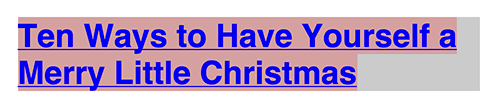
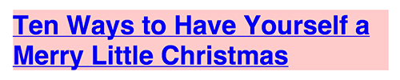
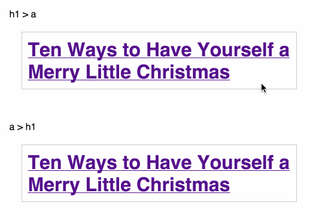
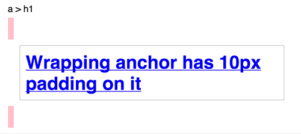

# Ссылка внутри заголовка или заголовок внутри ссылки?

> Это перевод статьи [Link in Header? Or Header in Link?](https://css-tricks.com/link-header-header-link/) Криса Койера.

Эрик Рэндж предложил написать статью на тему того, как правильнее — оборачивать заголовок в ссылку или наоборот? По спецификации HTML5 оба способа являются правильными.

Ссылка внутри заголовка:

```html
<h1>
  <a href="#">Ten Ways to Have Yourself a Merry Little Christmas </a>
</h1>
```

Заголовок внутри ссылки:

```html
<a href="#">
  <h1> Ten Ways to Have Yourself a Merry Little Christmas </h1>
</a>
```

Так какой из двух способов следует выбрать? Скажу, что это зависит от ваших целей. Давайте рассмотрим отличия.

## Кликабельная область

По умолчанию ссылка является строчным элементом, а заголовок — блочным. Так что если не изменять это через CSS, кликабельная область для `h1 > a` будет выглядеть так (подсвечена светло-красным):



Если же использовать `a > h1`, то кликабельной областью станет весь блок:



Такое же поведение можно повторить и с первым примером, сделав ссылку блочным элементом через CSS.

Вы можете сказать — «Больше кликабельной области! Это хорошо!», но от кликабельной области зависит поведение выделения текста.

## Выделение текста

Решать вам, важный это фактор или нет. Но лично я всегда выделяю текст, начиная с нижнего правого угла, и я всегда ненавидел из-за этого блочные ссылки:



## Странности раскладки

Если обернуть заголовок в ссылку и применить к ссылке padding меньше десяти пикселей, то можно обнаружить странный баг — отступ будет в `10px`:



## Два заголовка, одна ссылка

Если вам понадобится сделать заголовок и подзаголовок/пояснение к заголовку, то удобнее всего будет обернуть оба элемента в ссылку:

```html
<a href="#">
  <h1>Cheese is favorite holiday gift</h1>
  <p class="subtitle">From a one-person survey held in central Wisconsin</p>
</a>
```

## Проблемы с доступностью

Я не уверен, есть ли какие-то проблемы при использовании какого-либо из этих способов.

## Победитель?

Я предпочитаю использовать конструкцию `h1 > a`, и, как показал неформальный опрос, большинство людей тоже.

А какой способ используете вы?
